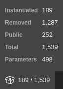
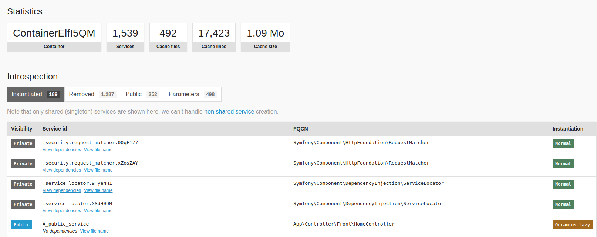

[](https://github.com/steevanb/symfony-container-introspection/tree/1.0.3)
[](https://php.net)
[](https://symfony.com)


[](https://scrutinizer-ci.com/g/steevanb/symfony-container-introspection/)

symfony-container-introspection
===============================

It helps you to know which services are registered, instanciated, public or private and list container parameters.

You have access to Container cache statistics: files count, count code lines and cache size.

With Symfony, a new profiler tab will appear:





[Changelog](changelog.md)

If you want to use it with `symfony/dependency-injection ^4.0`, see [^1.1](https://github.com/steevanb/symfony-container-introspection)

Installation
============

Don't use `^1.0.*` as version, because `1.1.0` is not compatible with `symfony/dependency-injection 3.4` (only with `^4.0`) but is marked as compatible by error.
```bash
composer require --dev steevanb/symfony-container-introspection 1.0.*
```

If you use Symfony (and not just symfony/dependency-injection), you can add `ContainerIntrospectionBundle` to your Kernel:
```php
# app/AppKernel.php
class Kernel
{
    public function registerBundles()
    {
        if ($this->getEnvironment() === 'dev') {
            $bundles[] = new \steevanb\ContainerIntrospection\Bridge\ContainerIntrospectionBundle\ContainerIntrospectionBundle();
        }
    }
}
```
